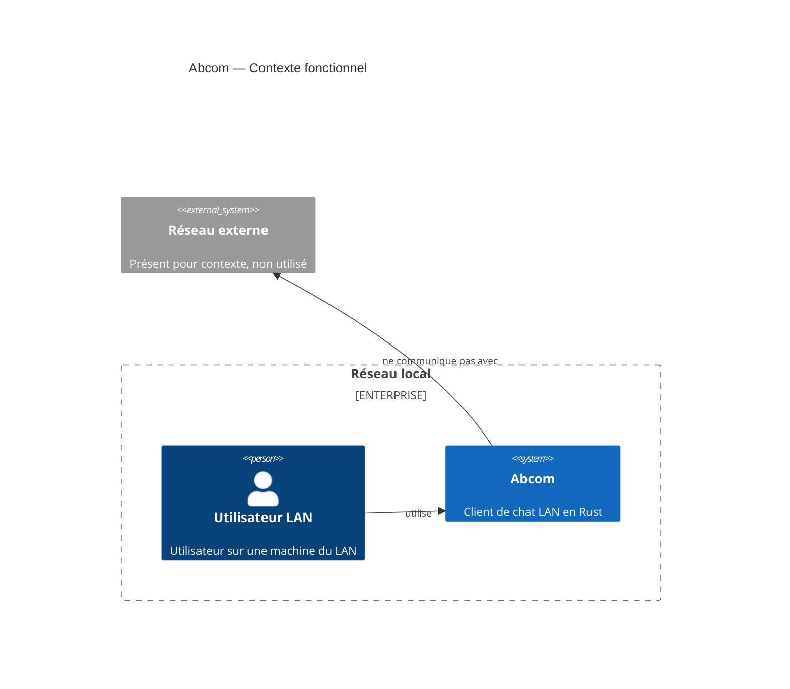

# Abcom

> 📅 **Généré le** : 2026-04-27  
> 🔖 **Stack analysée** : Rust 2021, tokio 1, serde 1, serde_json 1, eframe 0.31, egui 0.31, chrono 0.4, anyhow 1  
> 🔄 **À régénérer si** : refonte archi, changement majeur de stack, ajout/suppression de composant

## 🎯 Pitch projet
Abcom est une application de messagerie instantanée pour réseau local (LAN), écrite en Rust. Elle combine découverte de pairs par UDP broadcast et échange de messages JSON via TCP, avec une interface native `egui`.

## 🗺️ Parcours de lecture
- **Jour 1 — Onboarding**
  1. [Architecture globale](docs/01-architecture-globale.md)
  2. [Composant Abcom](docs/abcom/README.md)
  3. [Quick start](docs/02-developer-experience.md#-pour-utiliser)
  4. [Glossaire](docs/05-glossaire.md)
  5. [Notes de migration](docs/_MIGRATION_NOTES.md)

- **Semaine 1 — Contributeur**
  1. [Architecture globale](docs/01-architecture-globale.md)
  2. [DX globale](docs/02-developer-experience.md)
  3. [Déploiement systemd](docs/03-cicd-et-deploiement.md)
  4. [Sécurité globale](docs/04-securite-globale.md)
  5. [Composant Abcom](docs/abcom/README.md)
  6. [Structure du code](docs/abcom/01-architecture-et-structure.md)
  7. [Flux de données](docs/abcom/02-mecanismes-et-donnees.md)
  8. [Fiabilité et tests](docs/abcom/04-fiabilite-et-tests.md)

- **Mois 1 — Architecte**
  1. [Architecture globale](docs/01-architecture-globale.md)
  2. [DX globale](docs/02-developer-experience.md)
  3. [CICD et déploiement](docs/03-cicd-et-deploiement.md)
  4. [Sécurité globale](docs/04-securite-globale.md)
  5. [Glossaire](docs/05-glossaire.md)
  6. [Component README Abcom](docs/abcom/README.md)
  7. [Architecture du code](docs/abcom/01-architecture-et-structure.md)
  8. [Mécanismes et données](docs/abcom/02-mecanismes-et-donnees.md)
  9. [Performance](docs/abcom/03-performances-et-optimisations.md)
  10. [Fiabilité](docs/abcom/04-fiabilite-et-tests.md)
  11. [ADR](docs/adr/ADR-001-langage-et-stack-rust.md)

## 🏗️ Schéma C4 niveau 1



## 🚀 Quick start
```bash
cd /chemin/vers/abcom
make install
~/.local/bin/abcom
```

Pour développement et tests :
```bash
make run
# ou
cargo run --release -- <username>
```

## 📚 Sommaire exhaustif
- [Accueil](README.md)
- [Notes de migration](docs/_MIGRATION_NOTES.md)
- [Documentation globale](docs/01-architecture-globale.md)
- [Developer Experience](docs/02-developer-experience.md)
- [CICD et déploiement](docs/03-cicd-et-deploiement.md)
- [Sécurité globale](docs/04-securite-globale.md)
- [Glossaire](docs/05-glossaire.md)
- [ADR](docs/adr/ADR-001-langage-et-stack-rust.md)
- [ADR](docs/adr/ADR-002-architecture-lan-peer-to-peer.md)
- [Composant Abcom](docs/abcom/README.md)
  - [Architecture et structure](docs/abcom/01-architecture-et-structure.md)
  - [Mécanismes et données](docs/abcom/02-mecanismes-et-donnees.md)
  - [Performances et optimisations](docs/abcom/03-performances-et-optimisations.md)
  - [Fiabilité et tests](docs/abcom/04-fiabilite-et-tests.md)

## 🧭 Glossaire express
- [LAN](docs/05-glossaire.md#lan)
- [UDP broadcast](docs/05-glossaire.md#udp-broadcast)
- [TCP](docs/05-glossaire.md#tcp)
- [Tokio](docs/05-glossaire.md#tokio)
- [egui / eframe](docs/05-glossaire.md#egui--eframe)

## 📚 Voir aussi
- [Documentation globale](docs/01-architecture-globale.md)
- [Composant Abcom](docs/abcom/README.md)
- [Glossaire complet](docs/05-glossaire.md)
