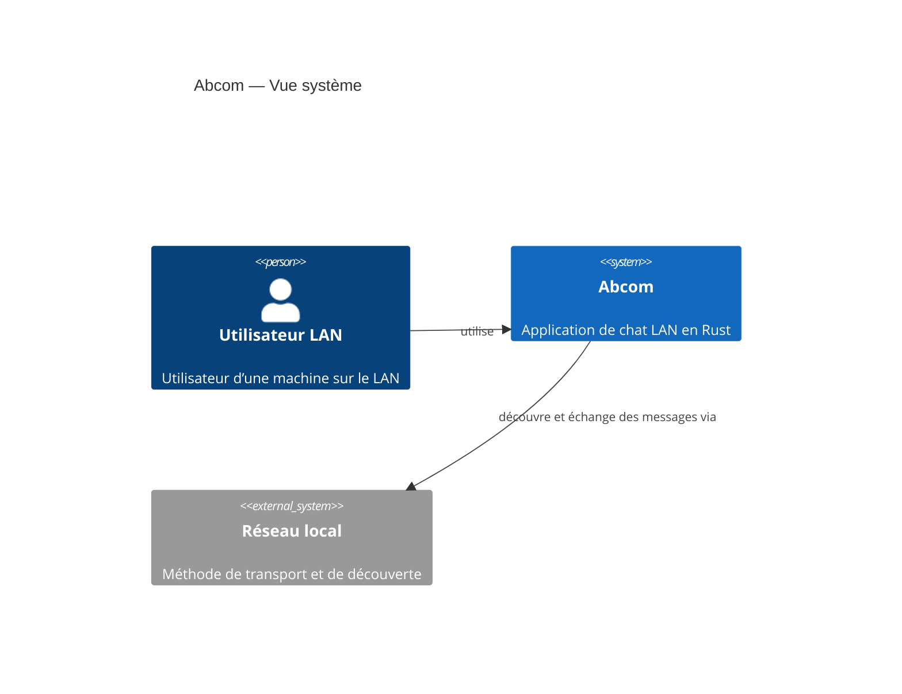

# Abcom

> 📅 **Généré le** : 2026-04-28
> 🔖 **Stack analysée** : Rust 2021, tokio 1, serde 1, serde_json 1, eframe 0.31, egui 0.31, chrono 0.4, anyhow 1
> 🔄 **À régénérer si** : refonte de l’architecture, ajout d’un service ou d’un composant, migration vers un backend central

## 🎯 Pitch projet
Abcom est une application de messagerie instantanée conçue pour un réseau local (LAN). Le client fonctionne en mode peer-to-peer, découvre automatiquement les pairs via UDP broadcast et échange les messages au format JSON par TCP.

> Ancienne documentation archivée dans les fichiers `.old.md` pour assurer traçabilité.

## 🏗️ Architecture globale
Le projet est un monolithe Rust à exécution locale. L’application combine un runtime Tokio, un serveur TCP, un émetteur UDP de découverte, et une interface graphique native `egui`.



## 🚀 Quick start

### Développement
```bash
cargo run --release -- <username>
```

### Installation locale
```bash
make install
```

### Déploiement utilisateur
```bash
bash scripts/abcom-install.sh ./target/release/abcom
systemctl --user enable --now abcom.service
```

### Mode distribution Docker
```bash
cd scripts/docker
docker compose up --build
```

## 📚 Sommaire exhaustif

- **Documentation globale**
  - [Architecture globale](docs/01-architecture-globale.md)
  - [Developer Experience](docs/02-developer-experience.md)
  - [CICD et déploiement](docs/03-cicd-et-deploiement.md)
  - [Sécurité globale](docs/04-securite-globale.md)
  - [Glossaire](docs/05-glossaire.md)
  - [Notes de migration](docs/_MIGRATION_NOTES.md)
- **Décisions (ADR)**
  - [Choix du langage Rust et de la stack](docs/adr/ADR-001-langage-et-stack-rust.md)
  - [Architecture peer-to-peer sur LAN](docs/adr/ADR-002-architecture-lan-peer-to-peer.md)
- **Composant Abcom**
  - [Présentation du composant](docs/abcom/README.md)
  - [Architecture et structure](docs/abcom/01-architecture-et-structure.md)
  - [Mécanismes et données](docs/abcom/02-mecanismes-et-donnees.md)
  - [Performances et optimisations](docs/abcom/03-performances-et-optimisations.md)
  - [Fiabilité et tests](docs/abcom/04-fiabilite-et-tests.md)

## 🧭 Glossaire express

- [LAN](docs/05-glossaire.md#lan)
- [UDP broadcast](docs/05-glossaire.md#udp-broadcast)
- [TCP](docs/05-glossaire.md#tcp)
- [Tokio](docs/05-glossaire.md#tokio)
- [egui / eframe](docs/05-glossaire.md#egui--eframe)
- [systemd user](docs/05-glossaire.md#systemd-user)
