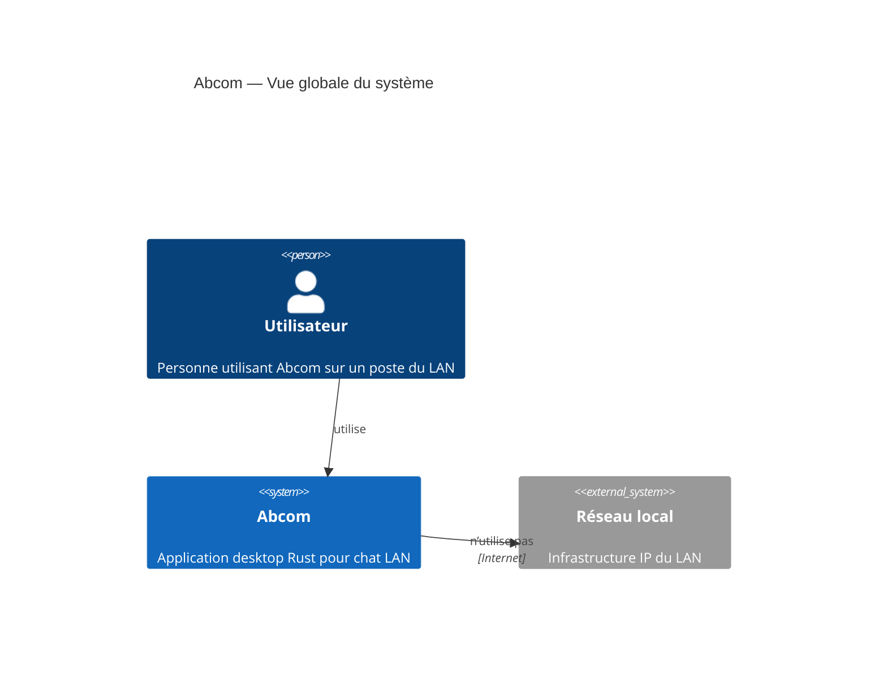

# Abcom

> 📅 **Généré le** : 2026-04-29
> 🔖 **Stack analysée** : Rust 2021, tokio 1, serde 1, serde_json 1, eframe 0.31, egui 0.31, chrono 0.4, anyhow 1

## 🎯 Pitch projet
Abcom est une application de messagerie instantanée pour réseau local (LAN). Elle découvre automatiquement les pairs sur le réseau, échange des messages JSON en TCP et présente une interface native `egui` sur le bureau.

## 🏗️ Vue d'ensemble
Abcom fonctionne sans serveur central ; chaque instance agit à la fois comme client et récepteur. La découverte des pairs se fait par UDP broadcast, puis les messages sont transmis en direct via TCP.

## 🚀 Quick start
- `cargo run --release -- <pseudo>` : démarrage de développement sur une machine Windows ou Linux.
- `make run` : exécute la version locale en conteneur de développement.
- `bash scripts/build-and-distribute.sh` : prépare une archive de distribution.
- `powershell -ExecutionPolicy Bypass -File .\scripts\install-windows.ps1 -Username MonPseudo` : installe Abcom sur Windows.

## 📚 Documentation
- [Architecture du système](docs/architecture-systeme.md)
- [Utilisation rapide](docs/utilisation-rapide.md)
- [Déploiement et installation](docs/deploiement-installation.md)
- [Maintenance et qualité](docs/maintenance-et-qualite.md)
- [Terminologie](docs/terminologie.md)
- [ADR — langage et stack Rust](docs/adr/ADR-001-langage-et-stack-rust.md)
- [ADR — architecture LAN peer-to-peer](docs/adr/ADR-002-architecture-lan-peer-to-peer.md)
- [Migration de la documentation](docs/MIGRATIONNOTES.md)

## 🧭 Navigation
- `src/main.rs` : démarrage, runtime Tokio, UI.
- `src/discovery.rs` : découverte UDP des pairs sur le LAN.
- `src/network.rs` : serveur TCP d’entrée et envoi de messages sortants.
- `src/ui.rs` : interface graphique `egui`.
- `src/app.rs` : état applicatif, historique et conversations.
- `src/message.rs` : structures de messages et événements.

## 🔧 Fichiers archivés
- `docs/INSTALL_WINDOWS.old.md` : ancienne documentation Windows archivée.
