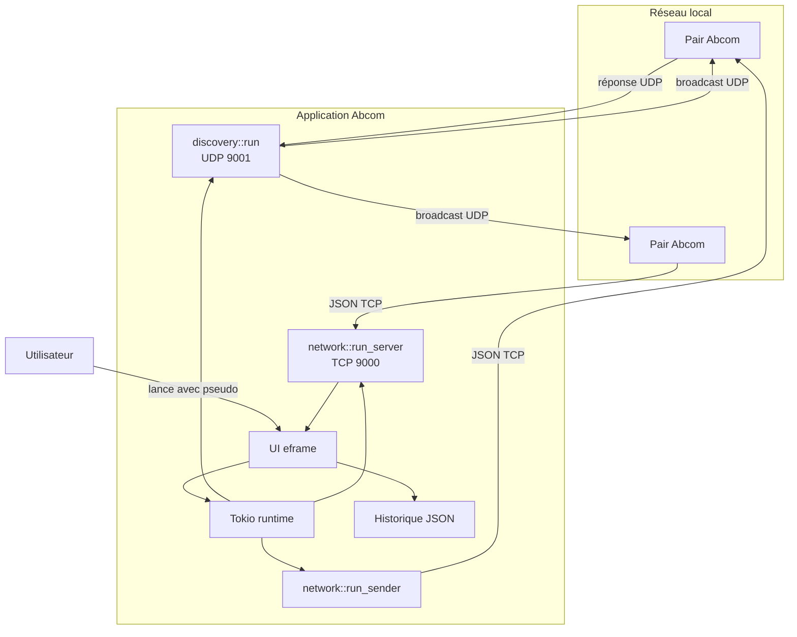
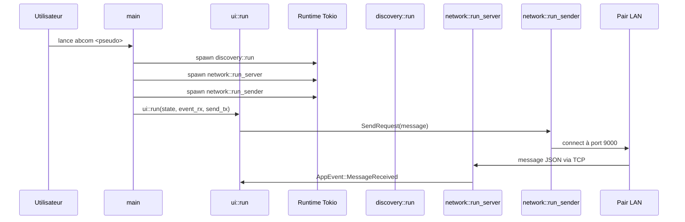

# Pitch

**🌱 Vision**
Abcom est une application de messagerie instantanée peer-to-peer pour réseau local (LAN), développée en Rust. Elle fonctionne sans serveur central : chaque instance découvre les autres dans le même sous-réseau et échange des messages JSON via TCP.

**🔧 Objectif**
Documenter l’architecture globale du projet, les commandes réelles de lancement et le rôle du code source. Cette documentation ne couvre que le convenu du système existant, sans invention de comportements externes.

# Contexte

**🌱 Contexte fonctionnel**
Abcom cible les environnements de bureau où plusieurs machines partagent un LAN local. Chaque utilisateur lance l’application avec un pseudonyme, puis la communication se fait automatiquement avec les pairs trouvés sur le réseau.

**🔧 Condition de déploiement**
Le projet est conçu pour être exécuté sur Linux et Windows. Un mode d’installation Linux est fourni dans `Makefile` et dans `scripts/abcom-install.sh`. Un script Windows existe dans `scripts/install-windows.ps1`.

**⚙️ Contraintes techniques**
- Découverte de pairs : UDP broadcast sur le port `9001`
- Transport de messages : TCP sur le port `9000`
- Interface native : `egui` / `eframe`
- Stockage local : JSON persisté via `dirs::data_dir()`

# Quick start

**🌱 Préparation**
Le projet se compile avec Rust. Les dépendances sont gérées par Cargo et la chaîne cible est Rust 2021.

**🔧 Développement**
```bash
cd /chemin/vers/abcom
cargo run --release -- Alice
```

**🔧 Installation Linux**
```bash
make install
abcom Bob
```

**🔧 Distribution portable**
```bash
bash scripts/build-and-distribute.sh
```

**🔧 Installation Windows**
```powershell
cd .\scripts
.\install-windows.ps1 -Username Alice
```

# Sommaire

## Services
- [Code applicatif](./src/readme.md)

## Sections de ce document
- [Pitch](#pitch)
- [Contexte](#contexte)
- [Quick start](#quick-start)
- [Architecture globale](#architecture-globale)
- [Déploiement](#déploiement)
- [Observabilité](#observabilité)
- [Décisions d’architecture (ADR)](#décisions-darchitecture-adr)
- [Glossaire](#glossaire)
- [Traçabilité de la documentation](#traçabilité-de-la-documentation)

# Architecture globale

**🌱 Vue d’ensemble**
Abcom est un client monolithique dont le code est centralisé dans `src/`. Il combine une interface graphique native avec un runtime Tokio pour l’E/S réseau et la découverte des pairs.

**🔧 Topologie système**
- `main.rs` initialise l’état, les canaux et le runtime Tokio.
- `discovery.rs` gère UDP broadcast pour détecter des pairs.
- `network.rs` gère l’écoute TCP entrante et l’envoi TCP sortant.
- `app.rs` stocke l’état applicatif et l’historique des conversations.
- `ui.rs` exécute la boucle `eframe` et présente l’interface.

**⚙️ Diagramme structurel**


## Flux global de communication


# Déploiement

**🌱 Modèle de déploiement**
Abcom se déploie comme un binaire autonome. Il n’exige pas de serveur central ni de base de données distante.

**🔧 Installation sur Linux**
- `make install` compile en `release` et copie le binaire dans `~/.local/bin`
- Le service systemd utilisateur est installé via `contrib/abcom.service`
- Un raccourci menu est copié dans `~/.local/share/applications`

**🔧 Distribution portable**
- `bash scripts/build-and-distribute.sh` génère un dossier `dist/abcom_<timestamp>/`
- Le dossier contient le binaire, `abcom-install.sh`, et des guides `README.md`/`DEPLOY.md`

**🔧 Installation Windows**
- `scripts/install-windows.ps1 -Username Alice`
- Le script compile en release si nécessaire et installe le binaire dans `%LOCALAPPDATA%\Programs\abcom`
- Il crée des raccourcis Bureau et Menu Démarrer

**⚙️ Limites observées**
- Il n’existe pas de pipeline CI/CD explicite dans le dépôt.
- Le déploiement repose sur des scripts shell et PowerShell locaux.

# Observabilité

**🌱 Nature des traces**
La visibilité est limitée au logging standard actuellement embarqué dans le code.

**🔧 Point de contrôle**
- `network.rs` utilise `eprintln!` pour les erreurs de liaison TCP et les erreurs d’envoi
- `ui.rs` affiche les erreurs d’initialisation graphique

**⚙️ Observabilité transverse**
- Pas de métriques structurelles
- Pas de trace distribuée
- Pas de journalisation orientée fichier ou rotation intégrée

# Décisions d’architecture (ADR)

## ADR-001 — Choix du langage et de la pile Rust

**Statut** : Accepté (rétro-actif)

**🌱 Contexte & problème**
Le projet vise une application native performante pour desktop avec accès direct aux sockets et à la GUI.

**🔧 Décision retenue**
Utiliser Rust 2021, `tokio` pour l’asynchrone, `serde` pour la sérialisation et `eframe`/`egui` pour l’interface native.

**⚙️ Conséquences & alternatives écartées**
- Avantage : compilation statique, mémoire sûre, performances.
- Limite : complexité de l’écosystème GUI en Rust.
- Alternative écartée : application web ou framework Electron non pris en charge par ce dépôt.

## ADR-002 — Architecture peer-to-peer LAN

**Statut** : Accepté (rétro-actif)

**🌱 Contexte & problème**
Le besoin est de communiquer sur un réseau local sans dépendre d’un service centralisé.

**🔧 Décision retenue**
Adopter une architecture P2P où chaque instance découvre et échange directement avec ses pairs.

**⚙️ Conséquences & alternatives écartées**
- Avantage : pas de serveur unique, résilience sur LAN.
- Limite : découverte et connexions limitées au même sous-réseau.
- Alternative écartée : modèle client-serveur avec broker.

## ADR-003 — Découverte UDP broadcast + transport TCP

**Statut** : Accepté (rétro-actif)

**🌱 Contexte & problème**
Il faut détecter des pairs dynamiques sans configuration manuelle d’adresses.

**🔧 Décision retenue**
Utiliser UDP broadcast sur le port `9001` pour annoncer le pseudo, et TCP sur le port `9000` pour transmettre les messages JSON.

**⚙️ Conséquences & alternatives écartées**
- Avantage : simplicité de découverte dans un LAN.
- Limite : dépendance aux capacités de broadcast du réseau.
- Alternative écartée : mDNS ou protocole de découverte dédié.

# Glossaire

- **LAN** : réseau local, segment de réseau confidentiel sans routage Internet nécessaire.
- **UDP broadcast** : message envoyé à toutes les machines du subnet pour découverte automatique.
- **TCP** : protocole orienté connexion utilisé ici pour transporter des messages JSON.
- **Tokio** : runtime asynchrone Rust.
- **eframe / egui** : bibliothèque GUI native Rust.
- **JSON** : format de sérialisation utilisé pour les `ChatMessage`.

# Traçabilité de la documentation

| Champ | Valeur |
|---|---|
| Version de la doc | `1.0.0` |
| Date de génération | `2026-04-29` |
| Commit de référence | `65278f5` (`65278f5a744a55fa4b8d3b5963bb3ddbc8abfed2`) |
| Branche | `hlm` |
| Tag Git associé | `v0.0.1` |
| Auteur de la génération | `GitHub Copilot` |

> Cette documentation reflète l'état du dépôt au commit ci-dessus. Toute divergence avec le code postérieur à ce commit doit être considérée comme obsolète et signalée.
