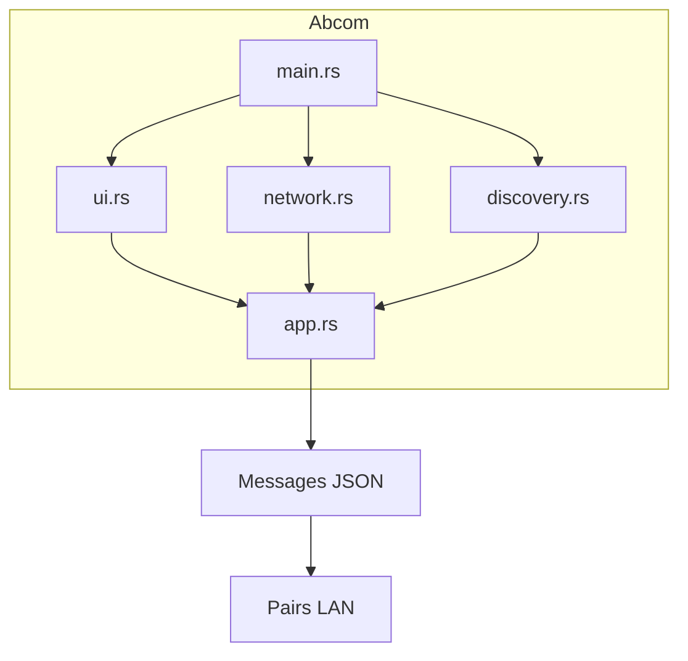

> [🏠 Accueil](../README.md) > [📘 Architecture globale](01-architecture-globale.md)

> 📅 **Généré le** : 2026-04-27  
> 🔖 **Stack analysée** : Rust 2021, tokio 1, serde 1, serde_json 1, eframe 0.31, egui 0.31, chrono 0.4, anyhow 1  
> 🔄 **À régénérer si** : refonte archi, changement majeur de stack, ajout/suppression de composant

# Architecture globale

## 🌱 Pour comprendre
Abcom est un monolithe Rust orienté client de messagerie LAN. Il exécute trois tâches concurrentes : découverte de pairs, réception TCP, et interface graphique native. Les messages échangés sont sérialisés en JSON et chaque machine agit à la fois comme émetteur et récepteur.

### Composants principaux
- `src/main.rs` : point d’entrée et orchestration des tâches.
- `src/discovery.rs` : diffusion UDP et découverte de pairs.
- `src/network.rs` : serveur TCP et envoi de messages.
- `src/ui.rs` : interface utilisateur `egui`.
- `src/app.rs` : état applicatif et gestion des pairs/messages.
- `src/message.rs` : protocoles de message et événements.

> [Schéma à finaliser dans Draw.io - structure proposée ci-dessous]
> Le fichier placeholder est disponible dans `docs/architecture-topology.drawio`.
> Il doit contenir : le client Abcom, la découverte UDP (`9001/udp`), le serveur TCP (`9000/tcp`) et les pairs LAN.

## 🔧 Pour utiliser
Le flux de démarrage est :
1. `main.rs` crée le runtime Tokio.
2. `discovery::run` envoie des broadcasts UDP sur le port `9001`.
3. `network::run_server` écoute les connexions TCP sur le port `9000`.
4. `ui::run` lance l’interface `egui` et consomme les événements réseau.

Le rôle des ports réseau :
- `9001/udp` : découverte des pairs via `DiscoveryPacket`.
- `9000/tcp` : transport des `ChatMessage`.

## ⚙️ Pour maîtriser
### Runtime et concurrence
Abcom utilise un runtime Tokio multi-thread.
- `tokio::runtime::Builder::new_multi_thread()`.
- Tâches lancées : `discovery::run`, `network::run_server`, `network::run_sender`.
- L’UI `egui` tourne sur le thread principal, tandis que Tokio gère le réseau en arrière-plan.

### Limites et points d’attention
- Le broadcast UDP utilise l’adresse `255.255.255.255`; cela suppose un réseau local non segmenté.
- Le serveur TCP lit l’intégralité du stream puis le décode, sans framing explicite.
- Le code ne vérifie pas l’identité des pairs : tout paquet JSON valide est accepté.

## 📚 Voir aussi
- [Developer Experience](02-developer-experience.md)
- [Composant Abcom](../docs/abcom/README.md)
- [Sécurité globale](04-securite-globale.md)
