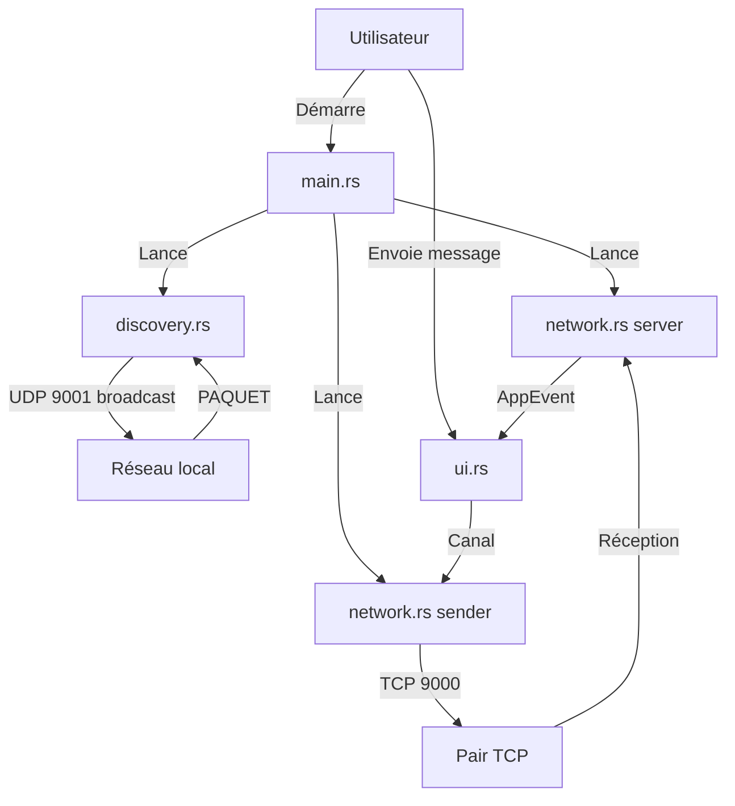

> [🏠 Accueil](../README.md) > [📘 Architecture globale](01-architecture-globale.md)

> 📅 **Généré le** : 2026-04-28
> 🔖 **Stack analysée** : Rust 2021, tokio 1, serde 1, serde_json 1, eframe 0.31, egui 0.31, chrono 0.4, anyhow 1
> 🔄 **À régénérer si** : refonte du modèle de découverte, ajout d’un backend central, introduction d’un service séparé

# Architecture globale

## 🌱 Vision globale
Abcom est une application monolithique Rust destinée au fonctionnement local sur un LAN. Le logiciel exécute en parallèle trois responsabilités principales :
- découverte automatique des pairs via UDP broadcast,
- réception de messages TCP entrants,
- affichage et interaction utilisateur via `eframe` / `egui`.

## 🔧 Composants principaux
- `src/main.rs` : initialise le runtime Tokio et crée les canaux de communication interne.
- `src/discovery.rs` : service de découverte LAN sur `9001/udp`.
- `src/network.rs` : serveur TCP sur `9000/tcp` et expéditeur de messages.
- `src/app.rs` : état applicatif, stockage des messages et sélection des conversations.
- `src/ui.rs` : interface graphique et gestion des interactions.
- `src/message.rs` : schémas de message JSON et événements internes.

```mermaid
C4Container
    title Abcom — Conteneurs internes
    Container_Boundary(abcom, "Abcom") {
        Container(main, "main.rs", "Initialise le runtime Tokio et lance les tâches", "Rust")
        Container(discovery, "discovery.rs", "Broadcast UDP et réception des paquets de découverte", "Rust")
        Container(network, "network.rs", "Serveur TCP + expéditeur TCP", "Rust")
        Container(ui, "ui.rs", "Interface graphique native eframe/egui", "Rust")
        Container(app, "app.rs", "Stocke l’état local, les pairs et l’historique", "Rust")
    }
    Rel(user, ui, "utilise")
    Rel(ui, app, "lit/écrit l’état applicatif")
    Rel(app, discovery, "ajoute les pairs découverts")
    Rel(app, network, "reçoit et envoie les messages")
```

## ⚙️ Flux de données
1. L’utilisateur démarre `abcom` avec un nom d’utilisateur.
2. `main.rs` lance trois tâches Tokio : discovery, serveur TCP, expéditeur TCP.
3. `discovery.rs` diffuse un `DiscoveryPacket` toutes les 3 secondes sur `255.255.255.255:9001`.
4. Quand un pair répond, un événement `AppEvent::PeerDiscovered` est envoyé au thread UI.
5. La sélection d’un pair ou du canal global impacte la destination des messages.
6. Les messages sont sérialisés en JSON et envoyés via TCP à `9000/tcp`.
7. Chaque message est persisté localement dans `~/.local/share/abcom/messages.json`.

### Diagramme de séquence des interactions

