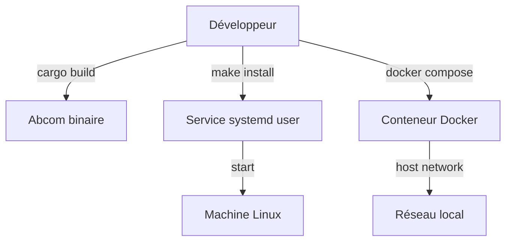

> [🏠 Accueil](../README.md) > [🚚 CICD et déploiement](03-cicd-et-deploiement.md)

> 📅 **Généré le** : 2026-04-28
> 🔖 **Stack analysée** : Rust 2021, tokio 1, serde 1, serde_json 1, eframe 0.31, egui 0.31, chrono 0.4, anyhow 1
> 🔄 **À régénérer si** : mise en place d’un pipeline CI/CD, distribution multi-plateforme, packaging par release

# CICD et déploiement

## 🌱 Situation actuelle
Le dépôt ne contient pas de configuration CI/CD formelle (`.github/workflows`, `gitlab-ci.yml`, etc.). La livraison actuelle repose sur des exécutables locaux, un service `systemd` utilisateur et des scripts Docker.

## 🔧 Déploiement local recommandé
### Pour un développeur Linux
```bash
make install
```

### Pour partager un binaire
```bash
bash scripts/abcom-install.sh ./target/release/abcom
```

### Activer le service
```bash
systemctl --user daemon-reload
systemctl --user enable --now abcom.service
```

### Docker
Le dossier `scripts/docker` contient :
- `Dockerfile` : image de build basée sur `rust:1.95`, avec dépendances graphiques pour `egui`.
- `docker-compose.yml` : trois services `alice`, `bob`, `charlie` sur `network_mode: host`.

```bash
cd scripts/docker
docker compose up --build
```

## ⚙️ Choix de déploiement
- **Local** : idéal pour le développement et les utilisateurs finaux sur Linux.
- **Service `systemd` utilisateur** : simple à activer, adapté à une session graphique.
- **Docker** : utile pour tests isolés, mais nécessite un accès au socket X11.

## 🔧 Points d’amélioration CI/CD
- Ajouter un workflow GitHub Actions ou GitLab CI pour `cargo build --release` et `cargo test`.
- Publier des artefacts de release pour les binaires Linux.
- Vérifier la compatibilité du service `systemd` sur différentes distributions.

### Diagramme de déploiement

