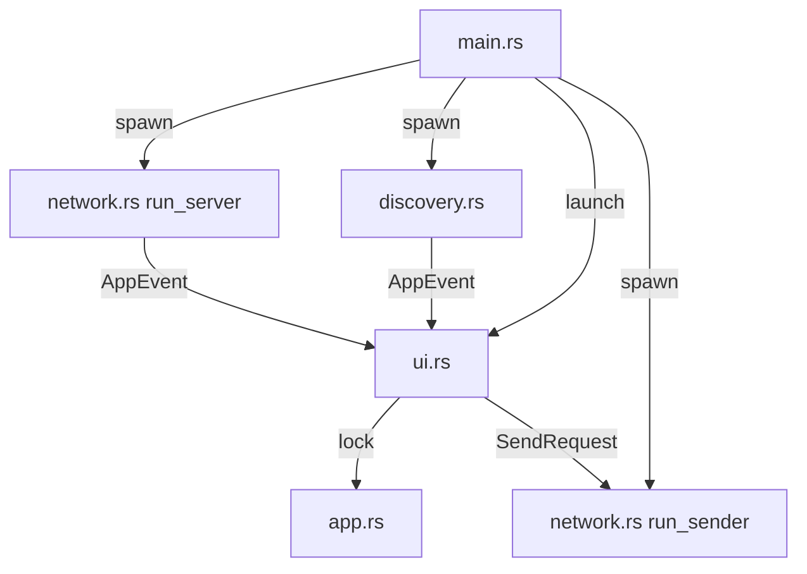

> [🏠 Accueil](../../README.md) > [📦 Composant Abcom](README.md) > Architecture et structure

> 📅 **Généré le** : 2026-04-28
> 🔖 **Stack analysée** : Rust 2021, tokio 1, serde 1, serde_json 1, eframe 0.31, egui 0.31, chrono 0.4, anyhow 1
> 🔄 **À régénérer si** : restructuration modulaire, extraction d’un service, changement de GUI

# Architecture et structure

## 🌱 Architecture interne
Abcom est un monolithe Rust avec une séparation logique en cinq modules principaux. Le binaire unique repose sur un `Arc<Mutex<AppState>>` partagé entre l’interface et les tâches réseau.

### Organisation des fichiers
- `src/main.rs` : construction du runtime Tokio, création des canaux `mpsc`, lancement des tâches.
- `src/app.rs` : état applicatif, gestion des pairs, messages et persistance.
- `src/discovery.rs` : découverte UDP, émission périodique et écoute des paquets.
- `src/network.rs` : serveur TCP et expéditeur asynchrone.
- `src/ui.rs` : rendu de l’interface et synchronisation des événements réseau.
- `src/message.rs` : types de données partagés et événements internes.
- `src/emoji_registry.rs` : ressources emoji embarquées pour l’UI.

## 🔧 Flux d’initialisation
1. `main.rs` lit l’argument `username` ou utilise `USER`.
2. Création de l’état global `AppState::new(username)`.
3. Configuration d’un runtime Tokio multi-thread.
4. Lancement des tâches : discovery, serveur TCP, expéditeur TCP.
5. Démarrage de l’interface `eframe::run_native` sur le thread principal.

## ⚙️ Structure des données partagées
- `AppState` contient :
  - `my_username`,
  - `peers`,
  - `messages`,
  - `selected_conversation`,
  - `typing_users`,
  - `history_path`.
- Les pairs sont stockés sous forme de `Peer { username, addr }`.
- Les messages sont des `ChatMessage` sérialisés en JSON.

### Gestion des conversations
- `selected_conversation == None` : canal global.
- `selected_conversation == Some(username)` : conversation privée.
- Les messages diffusés globalement ont `to_user = None`.
- Les messages privés ont `to_user = Some(username)`.
