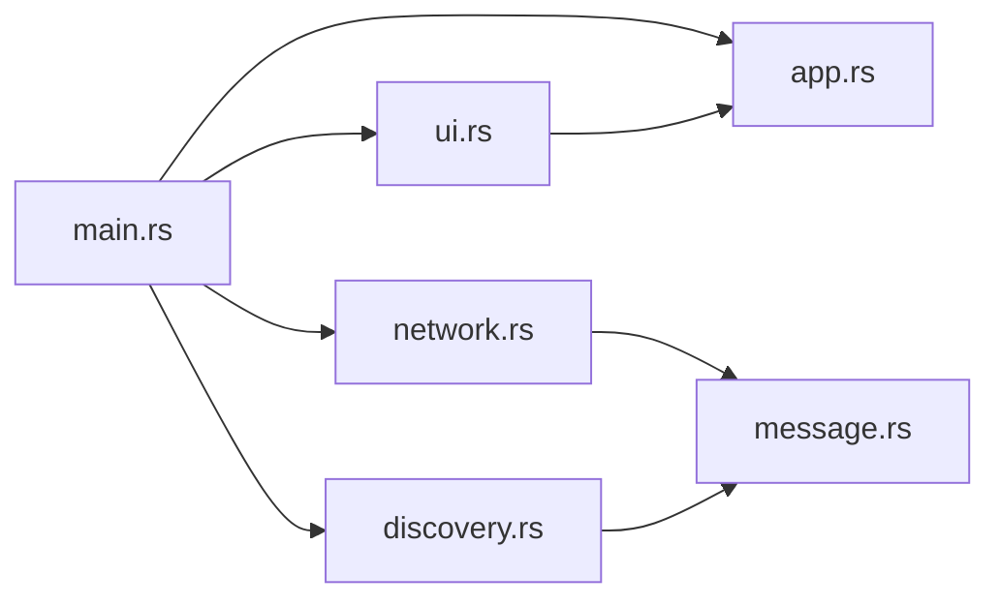

> [🏠 Accueil](../../README.md) > [📦 Composant Abcom](README.md) > [📐 Architecture et structure](01-architecture-et-structure.md)

> 📅 **Généré le** : 2026-04-27  
> 🔖 **Stack analysée** : Rust 2021, tokio 1, serde 1, serde_json 1, eframe 0.31, egui 0.31, chrono 0.4, anyhow 1  
> 🔄 **À régénérer si** : refonte archi, changement majeur de stack, ajout/suppression de composant

# Architecture et structure

## 🌱 Pour comprendre
Le composant Abcom est structuré en six modules Rust, chacun avec une responsabilité claire : démarrage, état applicatif, découverte, réseau, messages, et interface graphique.

## 🔧 Pour utiliser
### Fichiers clés
- `src/main.rs` : construction du runtime Tokio et création des canaux `mpsc`.
- `src/app.rs` : `AppState`, stockage des pairs et des messages, sélection de pair.
- `src/discovery.rs` : boucle UDP broadcast et réception de paquets `DiscoveryPacket`.
- `src/network.rs` : `run_server` (TCP) et `run_sender` (envoi TCP).
- `src/ui.rs` : application `eframe`/`egui` et boucle de rendu.
- `src/message.rs` : définitions `ChatMessage`, `DiscoveryPacket`, `AppEvent`, `SendRequest`.

## ⚙️ Pour maîtriser
### Interaction entre modules
- `main.rs` crée deux canaux MPSC : `event_tx/event_rx` et `send_tx/send_rx`.
- `discovery.rs` envoie `AppEvent::PeerDiscovered`.
- `network.rs` envoie `AppEvent::MessageReceived` et consomme `SendRequest`.
- `ui.rs` lit `AppEvent` et envoie `SendRequest` à `network::run_sender`.

### Pattern architectural
Le projet utilise un pattern message-driven léger : l’état global est centralisé dans `AppState`, et les interactions réseau sont relayées par des événements asynchrones.

### Détails de structure
- `AppState` est protégé par un `Arc<Mutex<...>>` pour permettre l’accès concurrent depuis l’UI et les tâches réseau.
- `selected_peer_addr()` convertit l’index de sélection en `SocketAddr` pour les envois TCP.
- Les messages sont conservés dans un tampon borné à 500 entrées, avec une purge de 100 éléments lorsque le seuil est dépassé.

## 📚 Voir aussi
- [Mécanismes et données](02-mecanismes-et-donnees.md)
- [Performances et optimisations](03-performances-et-optimisations.md)
- [Fiabilité et tests](04-fiabilite-et-tests.md)
