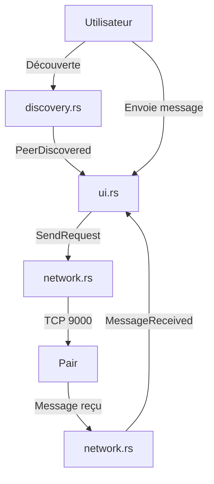

> [🏠 Accueil](../../README.md) > [📦 Composant Abcom](README.md) > Mécanismes et données

> 📅 **Généré le** : 2026-04-28
> 🔖 **Stack analysée** : Rust 2021, tokio 1, serde 1, serde_json 1, eframe 0.31, egui 0.31, chrono 0.4, anyhow 1
> 🔄 **À régénérer si** : nouveau protocole de message, mode multi-groupe ou persistence modifiée

# Mécanismes et données

## 🌱 Protocole réseau
Abcom utilise deux canaux distincts :
- **découverte** : UDP broadcast sur `9001/udp`, paquet JSON `DiscoveryPacket { username }`.
- **messages** : TCP point à point sur `9000/tcp`, message JSON `ChatMessage`.

### Schéma du paquet de découverte
```json
{
  "username": "Alice"
}
```

### Schéma du message de chat
```json
{
  "from": "Alice",
  "content": "Salut !",
  "timestamp": "12:34",
  "to_user": null
}
```

## 🔧 Comportement de découverte
- `src/discovery.rs` bind `0.0.0.0:9001` et active le broadcast.
- Toutes les 3 secondes, un `DiscoveryPacket` est envoyé vers `255.255.255.255:9001`.
- Les paquets entrants sont parsés et seuls les pairs avec un nom différent sont ajoutés.
- Un événement `AppEvent::PeerDiscovered` est envoyé à l’UI.

## 🔧 Transmission des messages
- Le serveur TCP de `src/network.rs` écoute `0.0.0.0:9000`.
- À chaque connexion entrante, le corps est lu en entier et converti en `ChatMessage`.
- L’expéditeur `run_sender` se connecte au `SocketAddr` du pair et envoie le JSON.
- La connexion est explicitement fermée après l’envoi pour permettre `read_to_end`.

## ⚙️ Persistance locale
- Le chemin de stockage est `dirs::data_dir()/abcom/messages.json`.
- `AppState::new` charge l’historique au démarrage si le fichier existe.
- À chaque nouveau message, `save_messages` écrit le JSON formaté.
- Une limitation conservatrice supprime les plus anciens messages au-delà de 500 entrées.

### Cas de figure des conversations
- Canal global : `to_user == None`.
- Conversation privée : `to_user == Some(username)`.
- `AppState::get_conversation_messages` filtre selon la sélection active.


