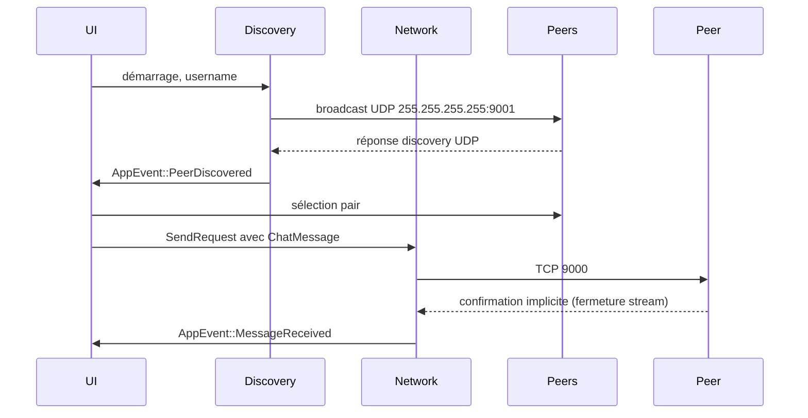

> [🏠 Accueil](../../README.md) > [📦 Composant Abcom](README.md) > [🔄 Mécanismes et données](02-mecanismes-et-donnees.md)

> 📅 **Généré le** : 2026-04-27  
> 🔖 **Stack analysée** : Rust 2021, tokio 1, serde 1, serde_json 1, eframe 0.31, egui 0.31, chrono 0.4, anyhow 1  
> 🔄 **À régénérer si** : refonte archi, changement majeur de stack, ajout/suppression de composant

# Mécanismes et données

## 🌱 Pour comprendre
Le flux de données Abcom repose sur deux mécanismes réseau distincts : la découverte de pairs par UDP et l’échange de messages par TCP. Chaque message est sérialisé en JSON et porté par des structures Rust dédiées.

## 🔧 Pour utiliser
### Protocoles et formats
- `DiscoveryPacket` :
  - `username: String`
  - envoyé en UDP broadcast toutes les 3 secondes.
- `ChatMessage` :
  - `from: String`
  - `content: String`
  - `timestamp: String`
  - envoyé en TCP à `TCP_PORT`.

### Flux de données

### Modèle d’état
- `AppState.peers` : liste des pairs découverts.
- `AppState.messages` : historique des messages afficher.
- `AppState.selected_peer` : index du pair choisi.

## ⚙️ Pour maîtriser
### Découverte de pairs
- `discovery::run` bind sur `0.0.0.0:9001`.
- Activation du broadcast UDP via `socket.set_broadcast(true)`.
- Ignorer son propre broadcast en comparant le pseudo.

### Envoi de messages
- `network::run_sender` reçoit `SendRequest` et crée une tâche `tokio::spawn` par envoi.
- Le TCP s’achève avec `stream.shutdown().await` pour forcer `read_to_end` côté serveur.
- Aucun chiffrement ni authentification n’est appliqué.

### Traitement des messages entrants
- `handle_incoming` lit tout le flux dans un buffer `Vec<u8>`.
- Le JSON est désérialisé en `ChatMessage`.
- Les erreurs de lecture ou de désérialisation sont silencieusement ignorées.

## 📚 Voir aussi
- [Architecture et structure](01-architecture-et-structure.md)
- [Sécurité globale](../../04-securite-globale.md)
