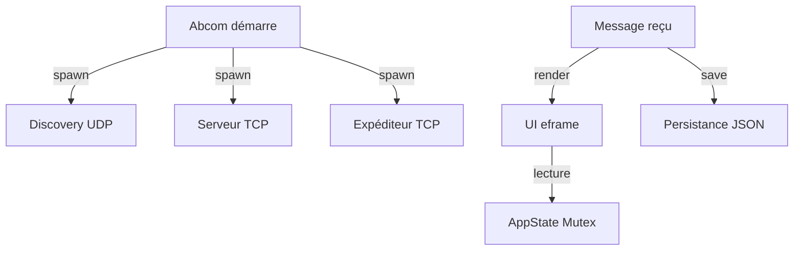

> [🏠 Accueil](../../README.md) > [📦 Composant Abcom](README.md) > Performances et optimisations

> 📅 **Généré le** : 2026-04-28
> 🔖 **Stack analysée** : Rust 2021, tokio 1, serde 1, serde_json 1, eframe 0.31, egui 0.31, chrono 0.4, anyhow 1
> 🔄 **À régénérer si** : optimisation de la boucle UI, gestion de gros volumes de messages, amélioration du rendu emoji

# Performances et optimisations

## 🌱 Points de performance essentiels
Abcom fonctionne en flux continu : découverte périodique, réception TCP et UI rafraîchie fréquemment. Les deux domaines critiques sont le CPU du runtime asynchrone et l’écriture disque du journal JSON.

## 🔧 Limites identifiées
- `save_messages` est appelé à chaque nouveau message et écrit tout le fichier en JSON formaté.
- La persistance des messages peut générer des I/O importants sur de longues sessions.
- Les textures emoji sont chargées paresseusement dans `ui.rs`, ce qui est bon, mais la mémoire graphique augmente.
- Le runtime Tokio tourne sur plusieurs threads, mais le partage de l’état se fait via un `Mutex` global.

## ⚙️ Optimisations déjà en place
- `AppState::add_message` conserve un maximum de 500 messages et supprime les plus anciens par paquets de 100.
- `ui.rs` demande un repaint toutes les 100 ms seulement.
- `load_emoji_textures` est exécuté une seule fois au démarrage de l’UI.

### Proposition d’améliorations
- remplacer la persistance JSON synchrone par un buffer asynchrone ou un journal append-only.
- découpler l’état des messages de l’UI via un canal dédié pour réduire le temps de blocage du `Mutex`.
- utiliser des structures indexées pour les conversations privées au lieu de filtrer à chaque rendu.
- limiter le nombre de textures chargées simultanément dans le picker emoji.

