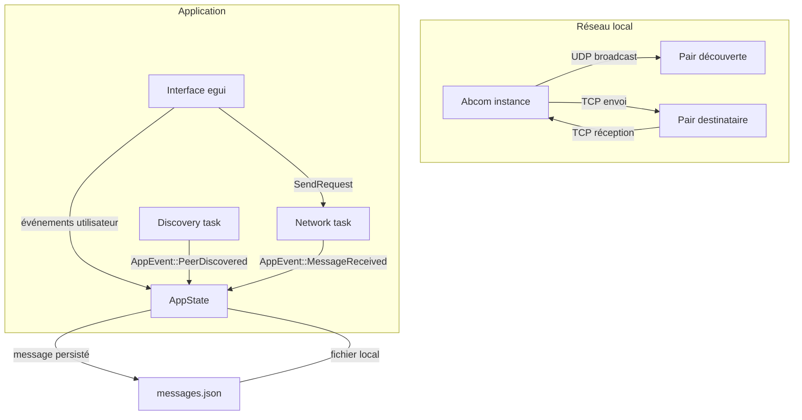

# Architecture du système

> [🏠 Accueil](../README.md)

## 🌱 Comprendre le rôle de chaque bloc
Abcom est une application native monolithique avec trois responsabilités principales :
- découverte de pairs sur le réseau local,
- transport des messages entre instances,
- interface graphique et stockage local.

Le système n’utilise pas de serveur externe : chaque instance est autonome et échange directement avec les pairs découverts.

## 🔧 Comment les composants s’assemblent

### Composants principaux
- `src/main.rs` : orchestration des tâches Tokio et lancement de l’UI.
- `src/discovery.rs` : diffusion et écoute UDP sur le port `9001`.
- `src/network.rs` : serveur TCP sur le port `9000` et expéditeur TCP sortant.
- `src/app.rs` : état de l’application, liste de pairs, historique des messages.
- `src/ui.rs` : rendu de l’interface, saisie, affichage et envoi.
- `src/message.rs` : modèles de messages JSON partagés.

## ⚙️ Détails internes et règles d’architecture
### Flux de démarrage
1. `main.rs` crée un runtime Tokio multi-thread.
2. `discovery::run` démarre la boucle UDP broadcast/écoute.
3. `network::run_server` écoute les connexions TCP entrantes.
4. `network::run_sender` traite les demandes d’envoi `SendRequest`.
5. `ui::run` démarre `egui` et récupère les événements réseau.

### Isolation des responsabilités
- `src/discovery.rs` ne parle jamais directement à l’UI : il émet des `AppEvent`.
- `src/network.rs` ne stocke pas l’état applicatif : il transmet uniquement via `AppEvent` et `SendRequest`.
- `src/ui.rs` ne réalise pas de I/O réseau direct : il délègue aux canaux Tokio.

### Modèle de vérité
- Les messages sont canoniquement stockés dans `AppState.messages`.
- La persistance locale se fait dans `dirs::data_dir()/abcom/messages.json`.
- Les pairs sont éphémères : calculés à partir des broadcasts UDP et nettoyés après `10` secondes d’inactivité.
- `selected_conversation`, `typing_users` et `read_counts` sont des états d’interface locaux.

### Contraintes de modification
- Toute nouvelle logique réseau doit passer par `AppEvent` ou `SendRequest`.
- Ne jamais appeler directement `network::run_sender` depuis l’UI : utiliser le canal `send_tx`.
- Si un nouveau type de message est ajouté, le struct `ChatMessage` dans `src/message.rs` doit rester compatible JSON.
