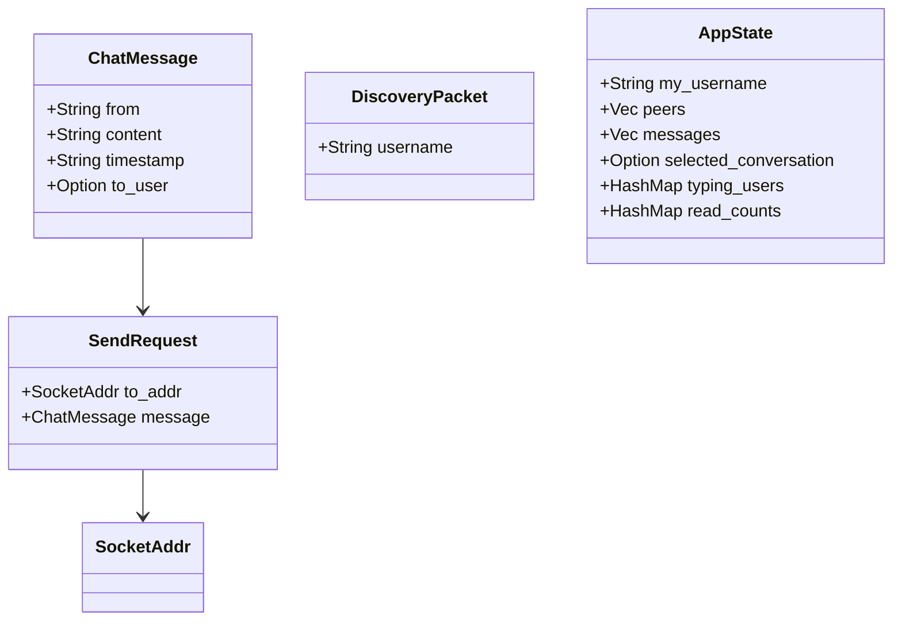
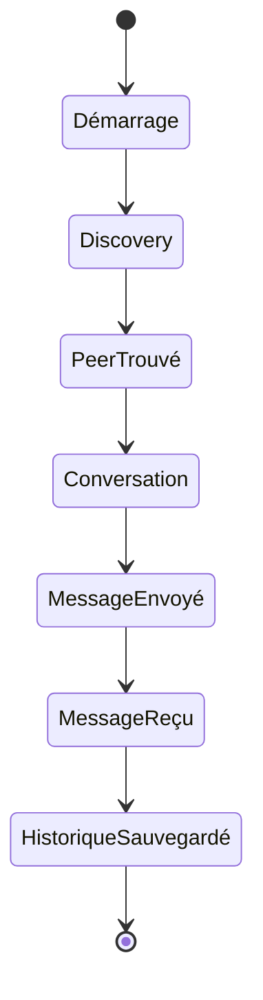

# Maintenance et qualité

> [🏠 Accueil](../README.md)

## 🌱 Où s’appuie la maintenance
L’essentiel de la qualité d’Abcom repose sur la robustesse du réseau local et la résilience des tâches Tokio. Le code se concentre sur :
- l’état applicatif dans `AppState`,
- la persistance locale des messages,
- la séparation UI / réseau / découverte.

## 🔧 Que faire pour vérifier et dépanner
### Compilation
```bash
cargo build --release
```

### Lancement en debug
```bash
cargo run -- MonPseudo
```

### Contrôle rapide
- `src/discovery.rs` : vérifier l’écoute et l’envoi UDP sur `0.0.0.0:9001`.
- `src/network.rs` : vérifier le serveur TCP sur `0.0.0.0:9000`.
- `src/ui.rs` : vérifier la capture du pseudo et la génération des `SendRequest`.

## ⚙️ Modèle de vérité et persistance
- `AppState.messages` est la source de vérité des conversations.
- La persistance est réalisée dans `dirs::data_dir()/abcom/messages.json` via `AppState::save_messages()`.
- Les messages sont chargés au démarrage avec `AppState::load_messages()`.
- Les pairs et les indicateurs de frappe sont volatiles et reset à chaque redémarrage.



## 🔧 Cycle de vie critique


## ⚙️ Contrats à respecter
- Ne jamais modifier `AppState.messages` sans sauvegarder via `save_messages()`.
- La découverte de peer doit impérativement circuler par `AppEvent::PeerDiscovered`.
- Les envois TCP sortants doivent toujours utiliser `SendRequest` et le port `TCP_PORT`.
- La logique d’interface ne doit pas manipuler directement `SocketAddr` en dehors de `src/network.rs`.

## 🔧 Observations de qualité
- Il n’existe pas de suite de tests unitaires dans le dépôt actuel. C’est un point de renforcement prioritaire.
- `AppState::add_message` limite la mémoire à `500` messages et purgera à partir de `100` anciens messages.
- Le nettoyage de pairs inactifs se produit toutes les `2` secondes et retire ceux sans broadcast depuis `10` secondes.
- Le picker emoji est chargé paresseusement à partir de `assets/emoji/*.png` pour éviter un temps de démarrage élevé.

## ⚙️ Scénarios de robustesse
- Si le fichier `messages.json` est absent ou corrompu, l’application redémarre avec un historique vide.
- Si le bind UDP ou TCP échoue, l’application remonte l’erreur sur stderr et continue partiellement.
- Si un pair disparaît, `AppState::cleanup_inactive_peers` retire l’entrée et revient à la conversation globale.
