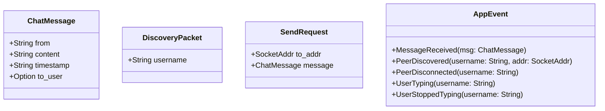

# Terminologie

> [🏠 Accueil](../README.md)

## 🌱 Concepts clés d’Abcom
Cette page définit les termes de base utilisés dans le code et la documentation.

### LAN
Réseau local privé utilisé pour la découverte et l’échange de messages. Abcom n’exige pas d’accès Internet.

### Pair
Une autre instance Abcom active sur le même LAN. Les peers sont découverts via UDP broadcast.

### Broadcast UDP
Envoi générique sur l’adresse `255.255.255.255:9001`, utilisé pour annoncer le pseudo de l’instance à tous les peers.

### TCP direct
Connexion point à point sur le port `9000` pour transmettre des messages `ChatMessage` sérialisés.

### Conversation global
Mode d’affichage où tous les messages non ciblés (`to_user == None`) sont affichés ensemble.

### Conversation directe
Échange privé entre deux utilisateurs. Le champ `to_user` contient le pseudo du destinataire.

### Historique local
Le fichier `messages.json` stocke le flux canonique des messages reçus et envoyés.

## 🔧 Correspondance code / terme
- `ChatMessage` : message de chat et réponse JSON.
- `DiscoveryPacket` : paquet UDP de découverte.
- `SendRequest` : requête de transmission envoyée au module réseau.
- `AppState` : état applicatif, y compris pairs, messages et statut de sélection.

## ⚙️ Structure des données

## ⚙️ Interprétation dans l’application
- `ChatMessage.from` : pseudo de l’utilisateur qui envoie.
- `ChatMessage.timestamp` : heure locale formatée, non normalisée.
- `ChatMessage.to_user == None` : message public global.
- `ChatMessage.to_user == Some(pseudo)` : message privé.
- `AppState.read_counts` : nombre de messages lus par peer.
- `typing_users` : données temporaires suivant les indicateurs de frappe.

## 🔧 À compléter
- La validation stricte du pseudo n’est pas décrite dans le code actuel.
- La durée exacte du message de typing dans l’UI est implémentée comme `3` secondes.
