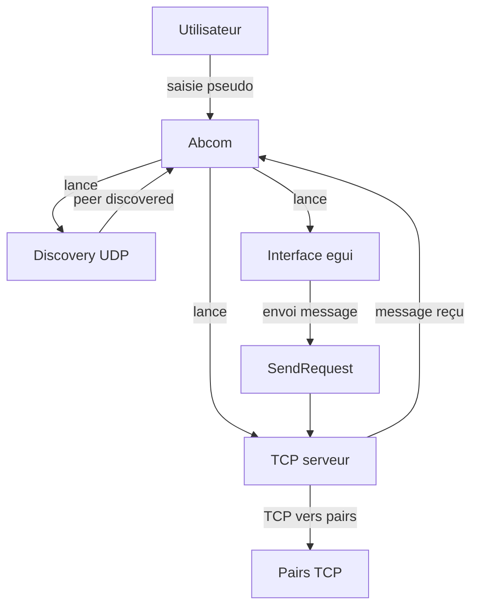

# Utilisation rapide

> [🏠 Accueil](../README.md)

## 🌱 Ce que fait Abcom en pratique
Abcom lance une application de chat LAN qui découvre automatiquement les pairs sur le réseau local, affiche les conversations disponibles et envoie des messages soit en mode global, soit en mode privé.

## 🔧 Commandes de base
### Développement local
```bash
cd C:/chemin/vers/abcom
cargo run --release -- MonPseudo
```

### Exécution en version debug
```bash
cargo run -- MonPseudo
```

### Version production prise en charge
```bash
bash scripts/build-and-distribute.sh
```

### Installation Windows
```powershell
powershell -ExecutionPolicy Bypass -File .\scripts\install-windows.ps1 -Username MonPseudo
```

## 🔧 Options de lancement
- Argument `MonPseudo` : nom d’utilisateur affiché dans le réseau.
- Sans argument : Abcom utilise la variable d’environnement `USER` ou `anonymous`.

## ⚙️ Ports et communication
- `DISCOVERY_PORT = 9001` : UDP broadcast pour la découverte des pairs.
- `TCP_PORT = 9000` : serveur TCP d’écoute des messages entrants.
- Format de message : JSON sérialisé via `serde_json`.

## 🔧 Choix d’usage
- Mode global : envoyer le message à tous les pairs connus.
- Mode direct : sélectionner un pair dans le panneau gauche puis envoyer.
- Groupes : l’UI affiche un emplacement, mais la logique de groupe n’est pas encore implémentée.

## ⚙️ Flux opérationnel


## 🔧 Fichiers importants
- `src/main.rs` : démarrage et orchestration.
- `src/app.rs` : sélection de conversation, états de lecture, historique.
- `src/message.rs` : types JSON partagés.
- `src/discovery.rs` : broadcasting et timeouts.
- `src/network.rs` : envoi/réception TCP.

## ⚙️ Conseils rapides
- Utilise `cargo build --release` pour réduire la latence d’UI.
- Pour tester sur plusieurs machines, lance Abcom sur chacune avec un pseudo différent dans le même LAN.
- Si un pair n’apparaît pas, vérifie que le port UDP `9001` est accessible en broadcast sur le réseau local.
