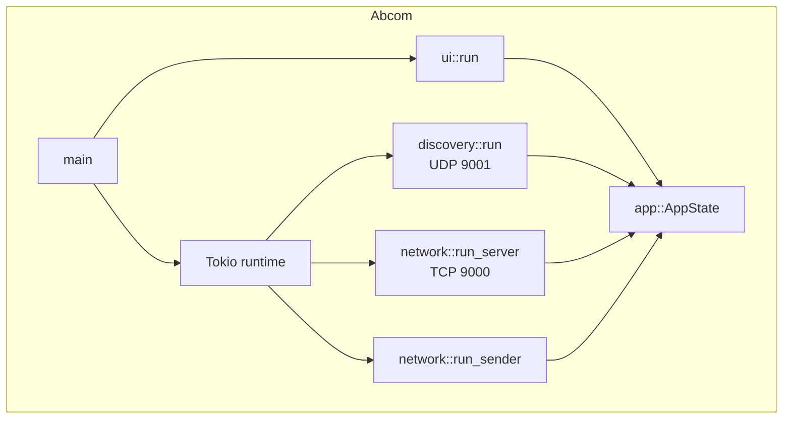
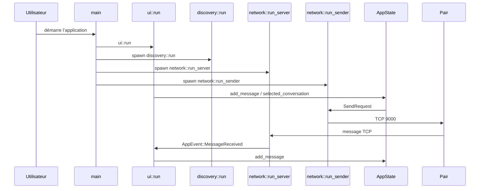

# Architecture

**🌱 Vue d’ensemble du service**
Le dossier `src/` contient l’application Abcom complète : orchestration, interface graphique, découverte de pairs et transport de messages.

**🔧 Composants principaux**
- `main.rs` : point d’entrée et initialisation du runtime Tokio
- `app.rs` : état applicatif, gestion des pairs, historique et messages
- `discovery.rs` : découverte UDP broadcast sur le port `9001`
- `network.rs` : serveur TCP entrant sur `9000` et client TCP sortant
- `ui.rs` : interface native avec `eframe`

**⚙️ Architecture interne**

## Stack et runtime

**🌱 Composants techniques**
Abcom s’appuie sur une pile Rust native. Le runtime asynchrone est géré par `tokio`, la sérialisation par `serde`, et l’interface par `eframe`.

**🔧 Dépendances clés**
- `tokio = { version = "1", features = ["full"] }`
- `serde = { version = "1", features = ["derive"] }`
- `serde_json = "1"`
- `eframe = "0.31"`
- `egui = "0.31"`
- `dirs = "5"`

**⚙️ Initialisation**
`main.rs` crée :
- `AppState::new(username)`
- deux canaux `mpsc` pour les événements et l’envoi de messages
- un runtime Tokio multi-thread
- trois tâches asynchrones : `discovery::run`, `network::run_server`, `network::run_sender`

# Configuration

**🌱 Valeurs configurées par le code**
Le code ne lit pas de fichier de configuration externe : les paramètres sont codés en dur et déduits de l’environnement.

**🔧 Variables d’environnement**
- `USER` : valeur par défaut du pseudonyme si aucun argument n’est fourni
- `HOME`, `LOCALAPPDATA` : utilisés par `dirs` pour construire le chemin de stockage local

**⚙️ Paramètres réseau**
- `TCP_PORT = 9000`
- `DISCOVERY_PORT = 9001`
- `BROADCAST_INTERVAL = 3` secondes
- `DISCOVERY_TIMEOUT = 10` secondes
- `CLEANUP_INTERVAL = 2` secondes

# Protocoles réseau

## Découverte UDP

**🌱 Rôle**
La découverte permet à chaque instance de trouver les autres pairs sur le même LAN sans configuration manuelle d’adresse.

**🔧 Mécanique**
- `discovery::run` bind `0.0.0.0:9001`
- envoie un `DiscoveryPacket { username }` toutes les 3 secondes en broadcast
- écoute les paquets entrants et ignore son propre pseudo
- transmet `AppEvent::PeerDiscovered` à l’UI

**⚙️ Mise en œuvre**
`DiscoveryPacket` est sérialisé en JSON avec `serde`. Les paquets UDP reçus sont convertis en `Peer` et stockés dans `AppState`.

## Messagerie TCP

**🌱 Rôle**
Le transport des messages textuels utilise TCP pour garantir une livraison simple d’un JSON `ChatMessage`.

**🔧 Mécanique**
- `network::run_server` écoute `0.0.0.0:9000`
- chaque connexion entrante est traitée dans `handle_incoming`
- le message JSON est lu avec `read_to_end`
- si `serde_json::from_slice::<ChatMessage>` réussit, un `AppEvent::MessageReceived` est envoyé

**⚙️ Mise en œuvre**
`network::run_sender` reçoit des `SendRequest` et se connecte au `SocketAddr` cible, écrit le message JSON, et ferme la connexion pour permettre à `read_to_end` du serveur de se terminer.

# Modèle de données

**🌱 Structure des objets**
Les données clés sont stockées en mémoire puis sérialisées localement. Les messages sont conservés en JSON dans un fichier d’historique.

**🔧 Entités**
- `ChatMessage`
  - `from: String`
  - `content: String`
  - `timestamp: String`
  - `to_user: Option<String>`
- `DiscoveryPacket`
  - `username: String`
- `Peer`
  - `username: String`
  - `addr: SocketAddr`
  - `last_seen: u64`
- `AppState`
  - `my_username: String`
  - `peers: Vec<Peer>`
  - `messages: Vec<ChatMessage>`
  - `selected_conversation: Option<String>`
  - `typing_users: HashMap<String, SystemTime>`
  - `read_counts: HashMap<String, usize>`
  - `history_path: PathBuf`

**⚙️ Stockage local**
`AppState::new` construit `history_path` à partir de `dirs::data_dir()` puis charge `messages.json` si le fichier existe. `save_messages` sérialise l’historique complet en JSON.

# Flux de message

**🌱 Vue fonctionnelle**
Le flux interne relie l’UI, le runtime asynchrone, la découverte, le TCP et le stockage local.

**🔧 Canal de communication**
- `ui.rs` lit la saisie utilisateur
- `AppState::add_message` ajoute localement le message
- `network::run_sender` envoie le message aux pairs sélectionnés
- `network::run_server` reçoit les messages entrants
- `ui.rs` met à jour l’affichage

**⚙️ Diagramme séquentiel**

# Interface graphique

**🌱 Architecture UI**
L’interface est construite avec `eframe` et utilise une boucle de rendu native. Le code sépare le panneau des conversations, le panneau des messages, et le champ de saisie.

**🔧 Composants UI**
- `SidePanel` pour la liste des pairs et la sélection de conversation
- `TopBottomPanel` pour le champ de saisie et les notifications
- `CentralPanel` pour l’affichage des messages
- Fenêtre modale pour les participants
- Picker emoji chargé à partir de `assets/emoji/*.png`

**⚙️ Optimisations visuelles**
- Chargement paresseux des textures emoji
- Utilisation de `egui::ImageButton` pour afficher les emojis
- Notification sonore via `print!("\x07")`

# Sécurité

**🌱 Limites de la sécurité actuelle**
Le projet n’embarque pas d’authentification, chiffrement ou validation d’identité. Il s’appuie uniquement sur la portée du LAN.

**🔧 Risques connus**
- Messages TCP non chiffrés sur `9000`
- UDP broadcast visible par toutes les machines du même sous-réseau
- Identifiants d’utilisateur non vérifiés

**⚙️ Recommandations**
- Ne pas exposer le réseau sur Internet
- Considérer l’ajout de chiffrement TLS pour le transport TCP
- Éviter de lancer Abcom sur un réseau non digne de confiance

# Tests et fiabilité

**🌱 État actuel**
Aucune suite de tests Rust n’a été détectée dans le dépôt. Les mécanismes observés reposent sur des comportements runtime et l’UI.

**🔧 Fonctionnalité de robustesse**
- `AppState` limite l’historique à 500 messages et supprime les plus anciens
- `discovery::run` nettoie les pairs inactifs après 10 secondes
- le code ignore les messages UDP auto-émis

**⚙️ Zone à compléter**
- Pas de tests unitaires ni d’intégration détectés
- Pas de simulation de réseau ni de couverture de cas d’erreur

# Déploiement spécifique

**🌱 Cible d’exécution**
Le service est développé pour fonctionner comme une application de bureau autonome.

**🔧 Scripts d’installation**
- `Makefile` : `make install`, `make release`, `make run`
- `scripts/abcom-install.sh` : déploiement portable Linux
- `scripts/install-windows.ps1` : installation Windows avec raccourcis

**⚙️ Spécificités**
- Le binaire Linux s’installe dans `~/.local/bin`
- Le service systemd utilisateur est activé via `contrib/abcom.service`
- Le binaire Windows s’installe sous `%LOCALAPPDATA%\Programs\abcom`

# Traçabilité de la documentation

| Champ | Valeur |
|---|---|
| Version de la doc | `1.0.0` |
| Date de génération | `2026-04-29` |
| Commit de référence | `65278f5` (`65278f5a744a55fa4b8d3b5963bb3ddbc8abfed2`) |
| Branche | `hlm` |
| Tag Git associé | `v0.0.1` |
| Auteur de la génération | `GitHub Copilot` |

> Cette documentation reflète l'état du dépôt au commit ci-dessus. Toute divergence avec le code postérieur à ce commit doit être considérée comme obsolète et signalée.
